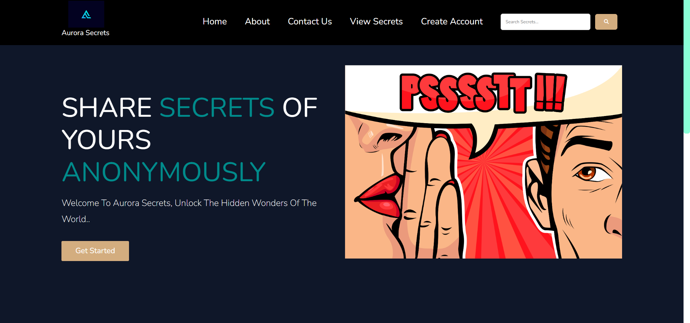
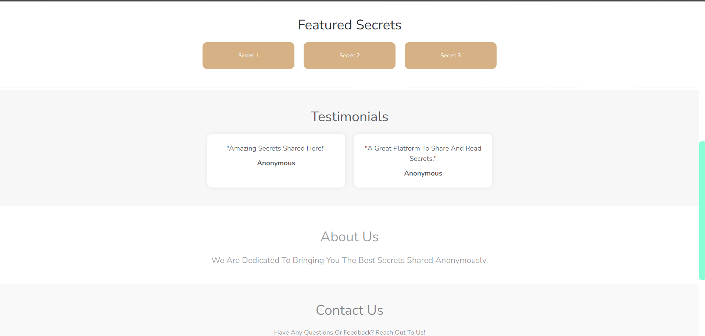
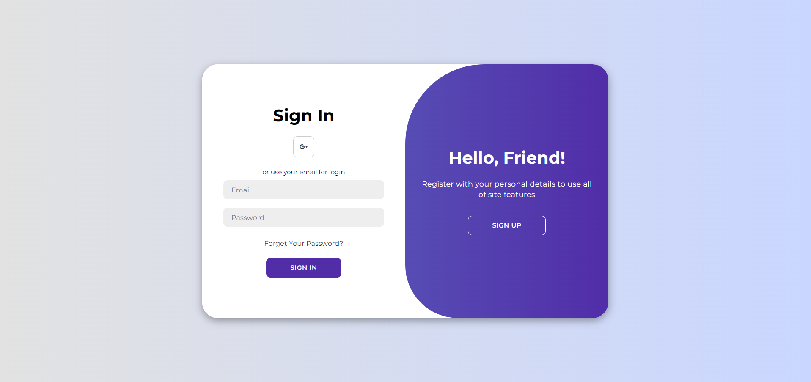
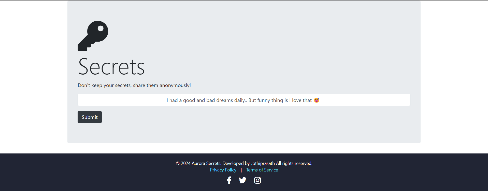
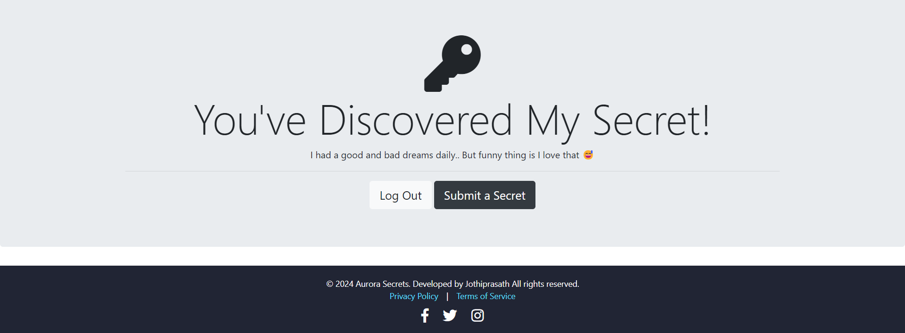

# Secrets App Documentation

### Project Overview

Secrets App (Aurora's Secret) is a web application built using ```Node.js```, ```Express.js```, ```EJS```. It allows users to log in locally or through Google Sign-In and provides functionality to view, create, and manage secrets. The application utilizes various NPM packages to handle ```authentication```, ```session management```, and ```database operations```.

### To Install Dependencies

```
npm i 

or

npm install
```

## Necessary NPM Packages or Dependencies

* Postgre SQL (Pg) => [pg](https://www.npmjs.com/package/pg)

        - PostgreSQL client for Node.js

* EJS (Embedded Javascript => [ejs](https://www.npmjs.com/package/ejs).

        - Embedded JavaScript templating engine.

* Express => [express](https://www.npmjs.com/package/express).

        - Web framework for Node.js

* Body-parser => [body-parser](https://www.npmjs.com/package/body-parser)

      - Middleware to parse incoming request bodies.
      
* Axios => [axios](https://www.npmjs.com/package/axios)

      -Axios is a promise-based HTTP client for Node.js and the browser to make HTTP requests.

* Bcrypt => [bcrypt](https://www.npmjs.com/package/bcrypt)

      -Library for hashing passwords.

* Dotenv => [dotenv](https://www.npmjs.com/package/dotenv)

      -Loads environment variables from a .env file.

* Express-session => [express-session](https://www.npmjs.com/package/express-session)

      -Middleware for session management.

* Passport => [passport](https://www.npmjs.com/package/passport)

      - Authentication middleware for Node.js.

* Passport-google-oauth2 => [passport-google-oauth2](https://www.npmjs.com/package/passport-google-oauth2)

      -Passport strategy for Google OAuth2 authentication.
      
* Passport-local => [passport-local](https://www.npmjs.com/package/passport-local)

      -Passport strategy for local username and password authentication.


## Features

* ***Local Authentication:*** Users can sign up and log in using a username and password.
* ***Google Authentication:*** Users can sign up and log in using their Google account.
* ***View Random Secrets:*** Users can view a list of random secrets shared by other users.
* ***Create and Manage Secrets:*** Logged-in users can create, view, and delete their own secrets.

### Technologies Used

* **Frontend:** EJS, CSS
* **Backend:** Node.js, Express.js
* **Database:** PostgreSQL
* **NPM Libraries:** body-parser, express, pg, ejs, axios, bcrypt, dotenv, express-session, passport, passport-google-oauth2, passport-local.
* **API:** Open Library API => [API](https://secrets-api.appbrewery.com/random)

### Prerequisites

* Node.js (v12.x or higher)
* npm (Node Package Manager)
* Postgre SQL(pgadmin)
* API

### Set up the PostgreSQL database

- Ensure PostgreSQL is installed and running.
- Create a database for the project.
- Set up the database schema

### To start the server 

```
nodemon server.js 

or

node server.js
```

##### Open in Browser

Open your browser and navigate to ```http://localhost:3000``` to view the application.

## Configuration

#### Environment Variables

* **SESSION_SECRET:** A secret key used to sign cookies for session management.
* **GOOGLE_CLIENT_ID:** Your Google OAuth2 Client ID.
* **GOOGLE_CLIENT_SECRET:** Your Google OAuth2 Client Secret.
* **DATABASE_URL:** URL to connect to your PostgreSQL database.

#### Authentication

* **Local Authentication:** Handled using passport-local and bcrypt for hashing passwords.
* **Google Authentication:** Handled using passport-google-oauth2.


#### Database

The application uses PostgreSQL for storing user and secret data. Ensure that the DATABASE_URL in your .env file points to a valid PostgreSQL instance.

## Usage
#### Logging In

* **Local Login:** Navigate to /login and provide your username and password.
* **Google Login:** Click the "Sign in with Google" button on the login page.

#### Viewing Secret

After logging in, you can view random secrets by navigating to the /secrets page.

#### Creating Secrets

* Navigate to the /secrets page.
* Enter your secret in the provided form and submit.

#### Managing Secrets
* **View Your Secrets:** On the /secrets page, you can view the secrets you have created.
* **Delete Your Secrets:** On the /secrets page, you can delete any of your secrets.

## Screenshots












## License 

This project is licensed under the MIT License - see the [MIT](https://choosealicense.com/licenses/mit/) License file for details.
